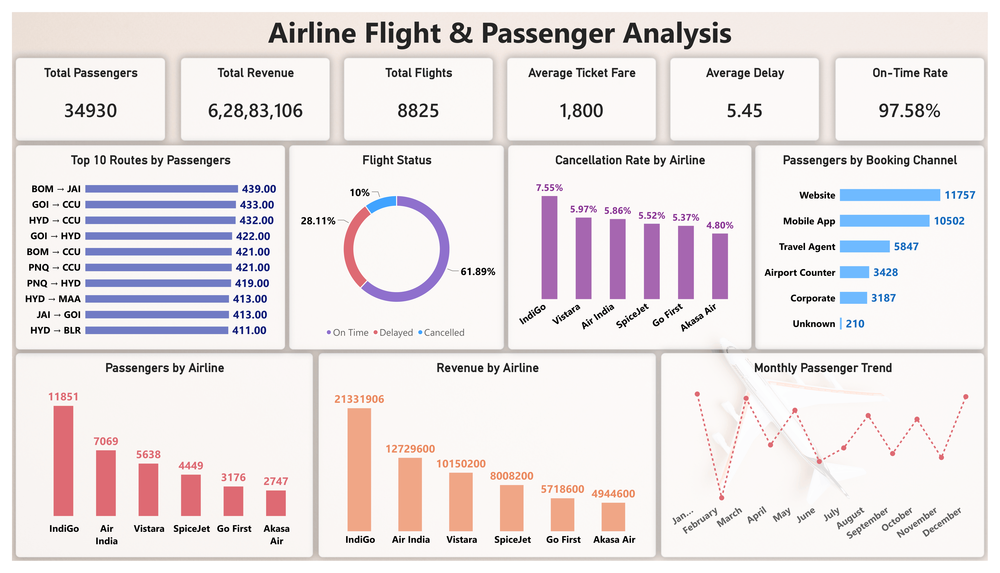

# Airline Flight & Passenger Analysis

A data analytics project focused on analyzing airline flights, passenger activity, revenue, delays, cancellations, routes, booking channels, aircraft performance, and passenger satisfaction using **Excel, SQL, Python, and Power BI**.

## Project Overview

This project analyzes a cleaned airline dataset of 34,935 passenger records to understand airline performance, passenger volume, revenue patterns, flight delays, cancellations, route performance, booking channels, aircraft types, and passenger satisfaction.

The raw data was initially cleaned and inspected in Excel, further cleaned and analyzed using Python, analyzed through SQL queries, and presented through a Power BI dashboard.

## Problem Statement

Airline datasets can contain duplicate records, missing values, inconsistent formatting, and mixed data formats, making them difficult to analyze directly.

This project focuses on cleaning and analyzing flight and passenger data to generate useful insights about airline performance, revenue, operational efficiency, passenger behavior, and flight reliability.

## Tools Used

- Excel – Initial Data Cleaning & Inspection
- Python – Data Cleaning & Exploratory Data Analysis
- MySQL – SQL Analysis
- Power BI – Dashboard & Visualization

## Project Workflow

**Raw Data → Excel Cleaning → Python Analysis → SQL Analysis → Power BI Dashboard → Final Insights**

## Dataset

- Original Records: 35,000
- Cleaned Records: 34,935
- Columns: 25

## Key Analysis Areas

- Airline performance analysis
- Passenger and flight volume
- Revenue and ticket fare analysis
- Flight status analysis
- Cancellation analysis
- Delay analysis
- Travel class analysis
- Booking channel analysis
- Top route analysis
- Monthly passenger trends
- Aircraft type performance
- Passenger satisfaction analysis

## Key Findings

- Total cleaned records: **34,935**
- Unique passengers: **34,930**
- Unique flights: **8,825**
- Total revenue: approximately **₹6.29 Crore**
- Average ticket fare: approximately **₹1,800**
- Average flight delay: **5.45 minutes**
- Overall on-time rate: **97.58%**
- **IndiGo** recorded the highest passenger volume and total revenue among the analyzed airlines
- **Website** was the most-used booking channel
- **Economy Class** had the highest passenger volume
- January recorded the highest monthly passenger volume, while February recorded the lowest
- Several routes showed relatively higher average delays despite having a significant number of flights

## Dashboard Preview

## Project Files

1. [Cleaned Dataset](1_airline_flight_and_passenger_analysis_data.csv)
2. [Python Analysis Notebook](2_airline_flight_and_passenger_analysis_python.ipynb)
3. [SQL Analysis](3_airline_flight_and_passenger_analysis_queries.sql)
4. [Power BI Dashboard](4_airline_flight_and_passenger_analysis_dashboard.pbix)
5. [Dashboard Preview](5_airline_flight_and_passenger_analysis_dashboard_image.png)
6. [Final Analysis Report](6_airline_flight_and_passenger_analysis_report.pdf)

## Conclusion

This project demonstrates how airline flight and passenger data can be cleaned, analyzed, and transformed into useful business insights using **Excel, Python, SQL, and Power BI**.

The analysis provides a practical view of airline performance, passenger behavior, revenue, operational efficiency, delays, cancellations, and route-level performance.
